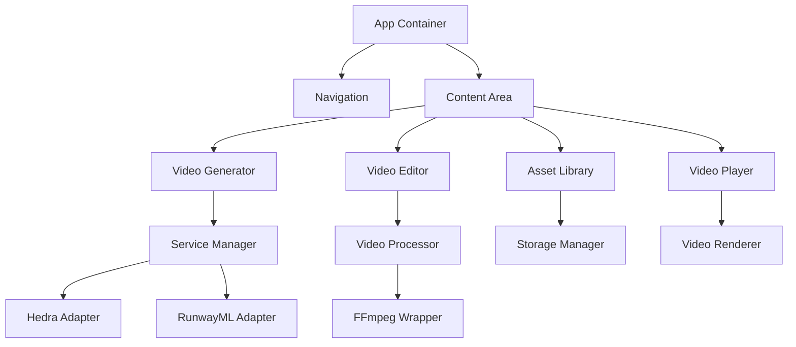

# System Patterns: Vidocrisy

## Architecture Overview
Vidocrisy follows a client-server architecture with a React frontend and Node.js backend:

```
Frontend (React.js)
├── UI Components
│   ├── Navigation
│   ├── Video Generation Form
│   ├── Video Player
│   ├── Video Editor
│   └── Asset Library
├── State Management (React Context API)
│   ├── User Preferences
│   ├── Video Assets
│   └── Application State
└── Services
    ├── API Client
    ├── Storage Client
    └── Video Processing

Backend (Node.js/Express)
├── API Gateway
│   ├── Route Handlers
│   └── Middleware
├── Service Integration
│   ├── Hedra API Client
│   ├── RunwayML API Client
│   └── Service Manager
├── Video Processing
│   ├── FFmpeg Wrapper
│   ├── Video Combiner
│   └── Transition Processor
└── Storage
    ├── Local File System
    └── (Future) Cloud Storage
```

## Key Technical Decisions
1. **Frontend Framework**: React.js for component-based UI development
   - Rationale: Widely adopted, excellent component ecosystem, good performance

2. **UI Library**: Chakra UI for component library
   - Rationale: Highly customizable, supports theming, accessible by default

3. **Backend**: Node.js with Express
   - Rationale: JavaScript across stack, efficient for API proxying, good for serverless

4. **Video Processing**: FFmpeg for video manipulation
   - Rationale: Industry standard, comprehensive capabilities, open source

5. **State Management**: React Context API over Redux
   - Rationale: Simpler implementation for a single-user application, reduced boilerplate

6. **Storage Strategy**: Local storage initially, with cloud options for future
   - Rationale: Minimizes costs during development, simplifies initial implementation

7. **Deployment**: GitHub Codespaces for development, static hosting for production
   - Rationale: Cost-effective, leverages existing GitHub infrastructure

## Design Patterns

1. **Component Pattern**
   - Modular UI components with clear responsibilities
   - Composition over inheritance for UI elements

2. **Provider Pattern**
   - Context providers for state management
   - Theme provider for consistent styling

3. **Adapter Pattern**
   - Service adapters for different AI video generation APIs
   - Standardized interface for all external services

4. **Factory Pattern**
   - Video processor factory for creating appropriate processing pipelines
   - Transition factory for generating different transition effects

5. **Command Pattern**
   - Video editing operations as commands
   - Supports undo/redo functionality

6. **Observer Pattern**
   - Event-based communication for video processing status
   - Subscription model for processing updates

## Component Relationships



## Data Flow

1. **Video Generation Flow**:
   ```
   User Input → Form Validation → API Request → 
   Service Manager → External API → Response Handling → 
   Video Storage → UI Update
   ```

2. **Video Editing Flow**:
   ```
   Video Selection → Edit Commands → Command Queue → 
   Video Processor → FFmpeg Operations → 
   Result Storage → Preview Update
   ```

3. **Asset Management Flow**:
   ```
   Asset Query → Storage Manager → File System/DB → 
   Result Filtering → UI Rendering
   ```

## Security Considerations

1. **API Key Management**:
   - Store API keys server-side only
   - Use environment variables for local development
   - Consider Google Cloud Secret Manager for production

2. **Content Security**:
   - Implement proper file validation for uploads
   - Sanitize user inputs to prevent injection attacks
   - Set appropriate CORS policies

3. **Data Protection**:
   - Implement proper error handling to prevent information leakage
   - Secure local storage with appropriate permissions
   - Consider encryption for sensitive data

## Performance Considerations

1. **Video Processing Optimization**:
   - Use efficient FFmpeg commands
   - Consider background processing for longer operations
   - Implement progress indicators for long-running tasks

2. **Asset Loading**:
   - Implement lazy loading for video assets
   - Use thumbnails for video previews
   - Consider pagination for large asset libraries

3. **UI Responsiveness**:
   - Optimize React rendering with memoization
   - Use web workers for CPU-intensive operations
   - Implement debouncing for frequent user interactions

## Notes
- The architecture prioritizes simplicity and cost-effectiveness for a personal tool
- The system is designed to be extensible for future integration with additional services
- Performance optimizations will be implemented incrementally as needed
- The design follows the user's aesthetic preferences with a futuristic, high-tech look
